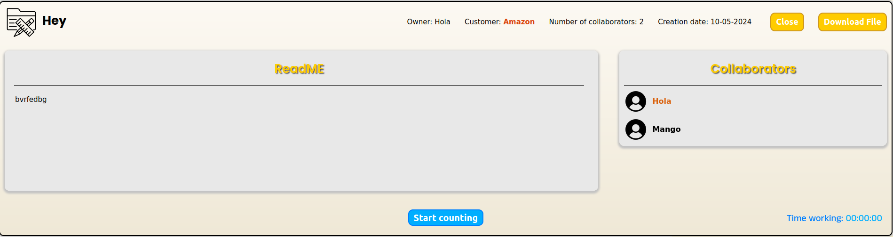

# Stafko
Stafko is a simple web application made with **React** and **NestJS** that allows users to create, store, and manage projects. 

## Screenshots

### Login

### Register

### Homescreen

### Navbar

### Navbar user menu

### Add project

### Add customer

### Edit customer

### Project card

### Project card view

**When you are not the project owner, you are able to see the information but you can't edit it.**

### Edit project name

### Edit project customer

### Add collaborators

### Search mobile navbar

**When you have a tablet/mobile resolution, a new icon with a lens in it will appear, when you click it, this navbar slides from the top.**

